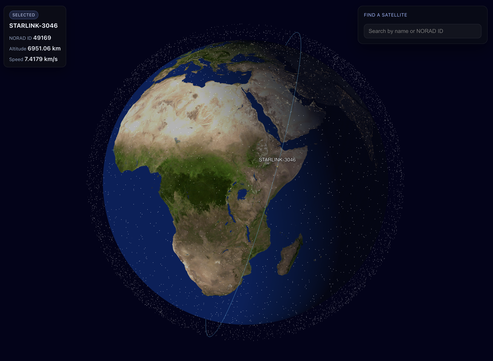

# Starlink Map

WebGL globe that renders live-ish Starlink positions from a FastAPI backend fed by Space-Track TLEs.
This is a small 2-day project I did for fun.

[Live](https://starlinkmap-breu.vercel.app)

